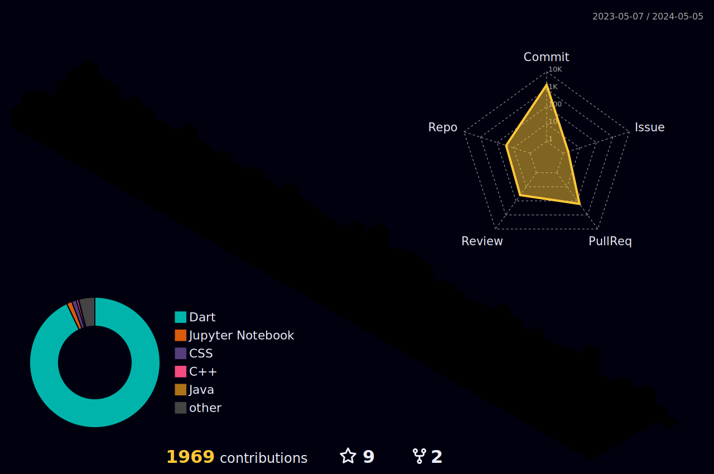

<h1 align="center">Coding, debugging, and delivering greatness.</h1> 
<h4 align="center">~that's Musfique, a CSE student</h4>
<h5 align="center">Always open for new and interesting projects. Let's connect and make something awesome together.</h5>

<p align="left">  </p>

<!--<h3 align="left">Connect with me:</h3>
<p align="left">
<a href="https://twitter.com/hellomusfique" target="blank"></a>
<a href="https://linkedin.com/in/musfique113" target="blank"></a>
<a href="https://fb.com/verygoodmusfique" target="blank"></a>
<a href="https://instagram.com/verygoodmusfique" target="blank"></a>
</p>
-->


<!-- <details>	
<summary>Languages and Tools:</summary>
<p align="left"> <a href="https://www.gnu.org/software/bash/" target="_blank" rel="noreferrer">  </a> <a href="https://getbootstrap.com" target="_blank" rel="noreferrer">  </a> <a href="https://www.w3schools.com/cpp/" target="_blank" rel="noreferrer">  </a> <a href="https://www.w3schools.com/css/" target="_blank" rel="noreferrer">  </a> <a href="https://www.docker.com/" target="_blank" rel="noreferrer">  </a> <a href="https://git-scm.com/" target="_blank" rel="noreferrer">  </a> <a href="https://www.w3.org/html/" target="_blank" rel="noreferrer">  </a> <a href="https://developer.mozilla.org/en-US/docs/Web/JavaScript" target="_blank" rel="noreferrer">  </a> <a href="https://www.linux.org/" target="_blank" rel="noreferrer">  </a> <a href="https://www.mysql.com/" target="_blank" rel="noreferrer">  </a> <a href="https://nodejs.org" target="_blank" rel="noreferrer">  </a> <a href="https://www.oracle.com/" target="_blank" rel="noreferrer">  </a> <a href="https://www.python.org" target="_blank" rel="noreferrer">  </a> <a href="https://reactjs.org/" target="_blank" rel="noreferrer">  </a> </p>
</details>  -->

<!-- <details>
    <summary>Programming Languages and Tools</summary>
    <a href="https://github.com/search?q=user%3Amusfique113+language%3Ac"></a>
    <a href="https://github.com/search?q=user%3Amusfique113+language%3Acpp"></a>
    <a href="https://github.com/search?q=user%3Amusfique113+language%3Ajava"></a>
    <a href="https://github.com/search?q=user%3Amusfique113+language%3Aassembly"></a>
    <a href="https://github.com/search?q=user%3Amusfique113+language%3Abash"></a>
    <a href="https://github.com/search?q=user%3Amusfique113+language%3Apython"></a>
    <a href="https://github.com/search?q=user%3Amusfique113+language%3Asql"></a>
    <a href="https://github.com/search?q=user%3Amusfique113+language%3Ajavascript"></a>
    <a href="https://github.com/search?q=user%3Amusfique113+language%3Ahtml"></a>
    <a href="https://github.com/search?q=user%3Amusfique113+language%3Amarkdown"></a>
    <a href="https://github.com/search?q=user%3Amusfique113+language%3Atex"></a>
  </details> -->

<!--
<details>	
<summary>Programming Languages and Tools</summary> 
<a href="" target="blank"></a>
</details>
-->
| Property             | Data                                                                                                                                                                                                                                                                                                                                                                                                                                                                                                                                                                                                                                                                                                                                                                                                                                                                                                                                                                                                                                                                                                                                                                                                                                                                                                                                                                                                                                                                                                                                                                                                                                                                                                                                                                                   |
|----------------------|------------------------------------------------------------------------------------------------------------------------------------------------------------------------------------------------------------------------------------------------------------------------------------------------------------------------------------------------------------------------------------------------------------------------------------------------------------------------------------------------------------------------------------------------------------------------------------------------------------------------------------------------------------------------------------------------------------------------------------------------------------------------------------------------------------------------------------------------------------------------------------------------------------------------------------------------------------------------------------------------------------------------------------------------------------------------------------------------------------------------------------------------------------------------------------------------------------------------------------------------------------------------------------------------------------------------------------------------------------------------------------------------------------------------------------------------------------------------------------------------------------------------------------------------------------------------------------------------------------------------------------------------------------------------------------------------------------------------------------------------------------------------------------------------------------------------------------------------|
| **Language**       |        |
|**Domain Knowledge**      | [](https://github.com/search?q=user%3ABEPb&type=Repositories) [](https://github.com/search?q=user%3ABEPb&type=Repositories) [](#) [](#) [](#) [](#)   [](https://en.wikipedia.org/wiki/Web_development) [](https://en.wikipedia.org/wiki/Database_management_system) |
| **IDEs**      | [](https://code.visualstudio.com/) [](https://developer.android.com/studio) [](https://www.jetbrains.com/pycharm/) [](https://www.jetbrains.com/idea/) [](https://netbeans.apache.org/) [](https://jupyterlab.readthedocs.io/en/stable/) [](https://jupyter.org/) |
| **CLIs**      | [](https://www.gnu.org/software/bash/) [](https://docs.microsoft.com/en-us/powershell/) [](https://en.wikipedia.org/wiki/Cmd.exe)|
|**OperatingSystem**      | [](https://www.microsoft.com/en-us/windows) [](https://ubuntu.com/) |
| **Frameworks & Tools**      | [](https://flutter.dev/) [](https://restfulapi.net/) [](https://git-scm.com/) [](https://github.com/) [](https://firebase.google.com/) |
| **Socials**      | [](https://twitter.com/hellomusfique) [](https://linkedin.com/in/musfique113) [](https://fb.com/verygoodmusfique) [](https://instagram.com/verygoodmusfique) [](mailto:musfique113@gmail.com) |

<details>	
<summary>Github Status</summary>  
<!-- <p></p> -->
  
  
  
<!--  -->
  



</details>		


<!-- 
<details>
<summary>Recent Activities</summary>
<!--START_SECTION:activity-->

<!--END_SECTION:activity-->
<!-- </details> 
-->


<details>	
<summary>Wakatime Stats</summary>  

<!--START_SECTION:waka-->


**🐱 My GitHub Data** 

> 📦 157.7 kB Used in GitHub's Storage 
 > 
> 🏆 303 Contributions in the Year 2023
 > 
> 💼 Opted to Hire
 > 
> 📜 16 Public Repositories 
 > 
> 🔑 12 Private Repositories 
 > 
**I'm a Night 🦉** 

```text
🌞 Morning                19 commits          █░░░░░░░░░░░░░░░░░░░░░░░░   04.83 % 
🌆 Daytime                63 commits          ████░░░░░░░░░░░░░░░░░░░░░   16.03 % 
🌃 Evening                139 commits         █████████░░░░░░░░░░░░░░░░   35.37 % 
🌙 Night                  172 commits         ███████████░░░░░░░░░░░░░░   43.77 % 
```
📅 **I'm Most Productive on Friday** 

```text
Monday                   56 commits          ████░░░░░░░░░░░░░░░░░░░░░   14.25 % 
Tuesday                  35 commits          ██░░░░░░░░░░░░░░░░░░░░░░░   08.91 % 
Wednesday                40 commits          ███░░░░░░░░░░░░░░░░░░░░░░   10.18 % 
Thursday                 49 commits          ███░░░░░░░░░░░░░░░░░░░░░░   12.47 % 
Friday                   73 commits          █████░░░░░░░░░░░░░░░░░░░░   18.58 % 
Saturday                 73 commits          █████░░░░░░░░░░░░░░░░░░░░   18.58 % 
Sunday                   67 commits          ████░░░░░░░░░░░░░░░░░░░░░   17.05 % 
```


📊 **This Week I Spent My Time On** 

```text
🕑︎ Time Zone: Asia/Dhaka

💬 Programming Languages: 
Dart                     10 hrs 56 mins      █████████████████████░░░░   85.10 % 
Markdown                 1 hr 38 mins        ███░░░░░░░░░░░░░░░░░░░░░░   12.79 % 
YAML                     11 mins             ░░░░░░░░░░░░░░░░░░░░░░░░░   01.50 % 
JSON                     3 mins              ░░░░░░░░░░░░░░░░░░░░░░░░░   00.44 % 
Other                    0 secs              ░░░░░░░░░░░░░░░░░░░░░░░░░   00.09 % 

🔥 Editors: 
Android Studio           8 hrs 57 mins       █████████████████░░░░░░░░   69.61 % 
VS Code                  3 hrs 54 mins       ████████░░░░░░░░░░░░░░░░░   30.39 % 

🐱‍💻 Projects: 
WeatherMate              3 hrs 46 mins       ███████░░░░░░░░░░░░░░░░░░   29.34 % 
weather_mate             2 hrs 44 mins       █████░░░░░░░░░░░░░░░░░░░░   21.35 % 
portfolip_app            1 hr 45 mins        ███░░░░░░░░░░░░░░░░░░░░░░   13.72 % 
fitnessui                1 hr 32 mins        ███░░░░░░░░░░░░░░░░░░░░░░   11.94 % 
GithubReadme             1 hr 8 mins         ██░░░░░░░░░░░░░░░░░░░░░░░   08.91 % 

💻 Operating System: 
Windows                  9 hrs 42 mins       ███████████████████░░░░░░   75.41 % 
Linux                    3 hrs 9 mins        ██████░░░░░░░░░░░░░░░░░░░   24.59 % 
```

**I Mostly Code in Java** 

```text
Java                     9 repos             █████████░░░░░░░░░░░░░░░░   36.00 % 
Dart                     6 repos             ██████░░░░░░░░░░░░░░░░░░░   24.00 % 
Jupyter Notebook         2 repos             ██░░░░░░░░░░░░░░░░░░░░░░░   08.00 % 
Python                   2 repos             ██░░░░░░░░░░░░░░░░░░░░░░░   08.00 % 
CSS                      2 repos             ██░░░░░░░░░░░░░░░░░░░░░░░   08.00 % 
```


**Timeline**


 Last Updated on 02/05/2023 06:11:16 UTC
<!--END_SECTION:waka-->
</details>	
